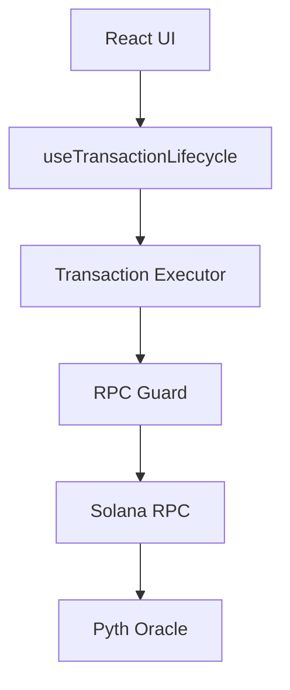

# Solana Credit Engine

Solana Credit Engine is a production-grade transaction orchestration and risk simulation engine for DeFi lending. It bridges the gap between raw on-chain protocols and high-integrity user interfaces, ensuring every transaction is validated, simulated, and optimized before the user signs.

## Why This Project Exists

Naive DeFi interfaces often suffer from silent failures, opaque risk profiles, and fragile RPC dependencies. The Solana Credit Engine solves these by:
- **Simulation-First Philosophy**: No transaction is signed without a successful on-chain simulation and risk impact preview.
- **Oracle-First Design**: Position health is calculated using real-time on-chain Pyth oracle prices, not cached or secondary REST APIs.
- **RPC Resilience**: A dedicated governance layer prevents rate-limiting and manages transaction finality with professional polling strategies.

## Architecture Overview

## Core Engineering Features

- **Standardized Lifecycle State Machine**: Tracks transactions through `Idle → Building → Simulating → Optimizing → Awaiting Signature → Sending → Confirming → Success`.
- **Simulation Preview Layer**: Dynamically estimates compute units and projects the impact on Health Factor (HF) before execution.
- **Dynamic Compute Budgeting**: Injecting priority fee and compute unit instructions based on real-time network congestion.
- **RPC Burst Governance**: Transparent 429 handling and request spacing to ensure high-reliability communication.
- **Memory-Cached On-Chain Prices**: Fetches and parses raw Pyth Oracle account data with a 30s smart cache.
- **Atomic Leverage Loop**: Composes multiple instructions (Supply, Borrow, Swap, Re-deposit) into a single atomic Transaction.
- **CI-Enforced Correctness**: Full test suite verifying risk math, parsing logic, and execution flows.

## Risk Engine Specification

- **Health Factor**: `(Collateral Value * Liquidation Threshold) / Debt Value`. An HF > 1.0 is required to remain safe from liquidation.
- **Liquidation Price**: The asset price at which `HF = 1.0`. Calculated via `Debt Value / (Collateral Amount * Liquidation Threshold)`.
- **Decimal Safety**: Strictly uses `BN.js` for all lamport-level calculations to prevent floating-point precision loss.

## Infrastructure Discipline

- **429 Rate Limit Handling**: Automatic halts and exponential backoff when encountering RPC congestion.
- **Priority Fee Estimation**: Monotonic cache for recent priority fees to minimize redundant RPC calls.
- **Polling Governance**: Intelligent signature status checks with capped retries and monotonic time advancement in tests.

## Testing & CI

- **Coverage**: ~76% overall, with core engine logic exceeding 90%.
- **Deterministic Testing**: Uses Vitest fake timers to bypass cache windows and verify complex retry/timeout behaviors.
- **Validation**: Includes integration tests for Pyth account parsing and Jupiter routing.

## Failure Modes & Assumptions

- **Oracle Stale Prices**: Falls back to Jupiter/CoinGecko REST APIs if Pyth accounts are unreachable or stale.
- **Compute Budget Fallback**: Applies a conservative 200,000 unit limit if simulation fails.
- **RPC Stability**: In the event of persistent RPC failure, the engine halts the status at `Failed` and surfaces a human-readable diagnosis instead of raw JSON logs.

## Demo

[Placeholder: Link to Demo Video]

### Screenshots

[Placeholder: UI Overview]
[Placeholder: Leverage Loop Preview]

## License

MIT © 2026 Solana Credit Engine Team
