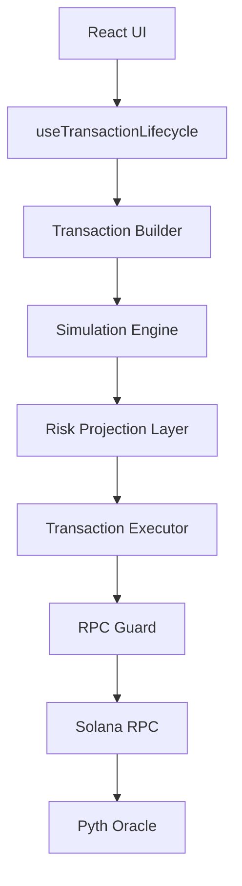

# System Architecture

The Solana Credit Engine is designed as a high-integrity transaction orchestration layer for Solana lending protocols. It prioritizes risk simulation and RPC reliability to provide an institutional-grade user experience.

## Theoretical Flow

## Core Components

### 1. The Simulation Engine (`/src/engine/simulation.ts`)
Before any transaction is signed, it must pass a local simulation. The engine:
- Prefetches account state.
- Simulates the transaction using `simulateTransaction`.
- Extracts compute units to set accurate dynamic priority fees.

### 2. Risk Projection Layer (`/src/engine/risk.ts`)
Calculates the impact of a transaction on the user's position health *before* execution.
- **Health Factor (HF)**: Derived from the ratio of collateral value to debt value, weighted by liquidation thresholds.
- **Liquidation Price**: The projected SOL price at which the Health Factor hits 1.0.

### 3. RPC Guard (`/src/lib/rpcGuard.ts`)
A governance layer for all outgoing RPC requests to prevent rate-limiting (429) and handle transient network failures.
- **Burst Governance**: Limits concurrent requests.
- **Polling Intervals**: Monotonic backoff for transaction confirmation polling.

### 4. Atomic Leverage Loop (`/src/engine/leverageLoop.ts`)
Orchestrates 4 distinct operations into a single atomic Transaction:
1.  **Supply**: Initial collateral deposit.
2.  **Borrow**: USDC debt creation.
3.  **Swap**: Jupiter V6 USDC → SOL routing.
4.  **Re-deposit**: Supplying swapped SOL back into the position.

## Transaction Lifecycle sequence

1.  **Building**: Gathering instructions and address lookup tables.
2.  **Simulating**: verifying validity and estimating compute units.
3.  **Optimizing**: Injecting `ComputeBudget` instructions for prioritized inclusion.
4.  **Awaiting Signature**: Passing the transaction to the user's wallet provider.
5.  **Sending**: Broadcasting to the network via the RPC Guard.
6.  **Confirming**: Polling for transaction finality.
7.  **Finalized**: Updating the UI and clearing local caches.

## Safety Assumptions
- **Price Freshness**: On-chain Pyth prices are used as the primary source of truth, with a 30s cache.
- **Slippage**: Jupiter swaps are configured with a default 0.5% slippage tolerance, adjustable via inputs.
- **Compute Fallback**: If simulation fails to return units, a conservative default of 200k units is applied.
